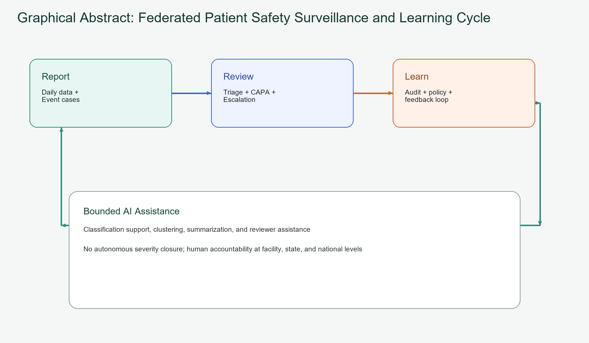

# Graphical abstract

Federated patient safety surveillance and learning cycle for India.

This visual summarizes the operational sequence: reporting, review, escalation, corrective action, governance, and system-level learning, with bounded AI assistance under human oversight.

